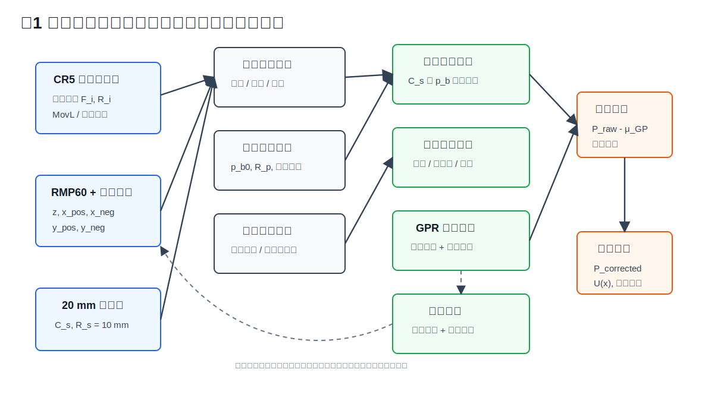
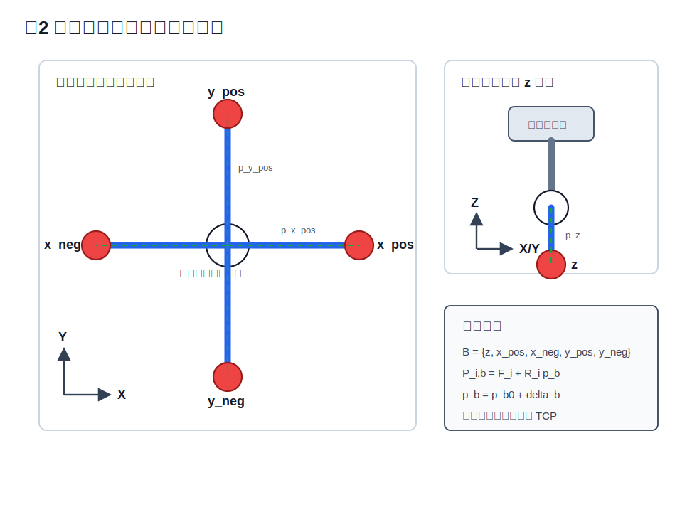
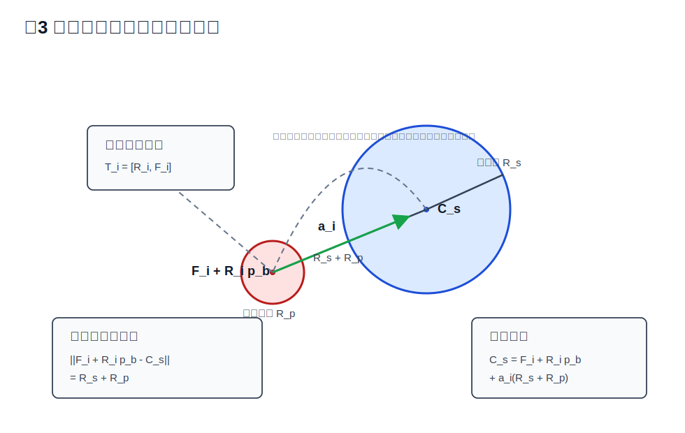
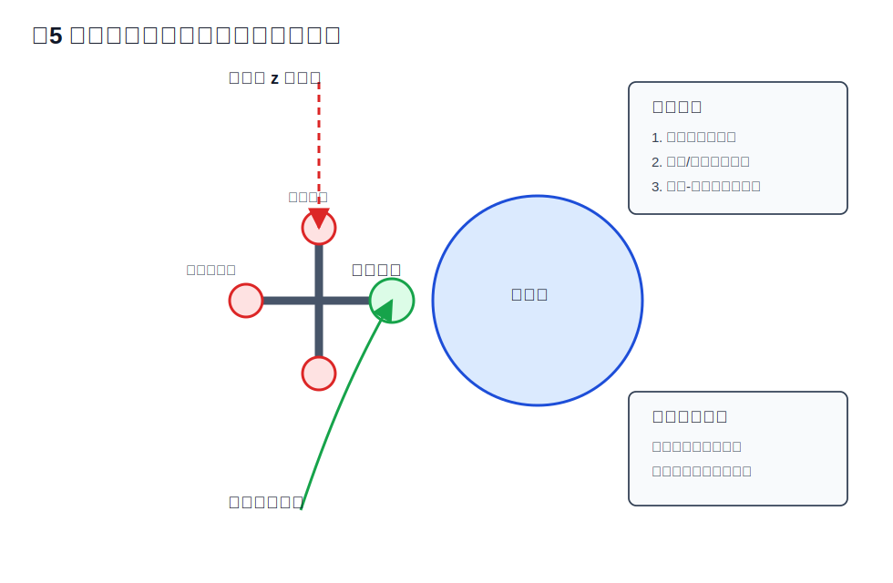
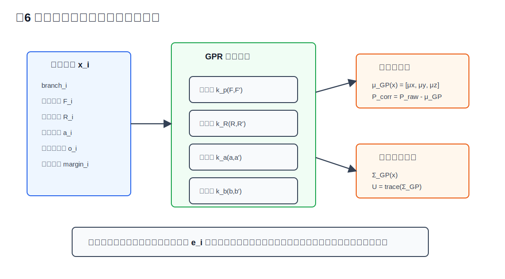
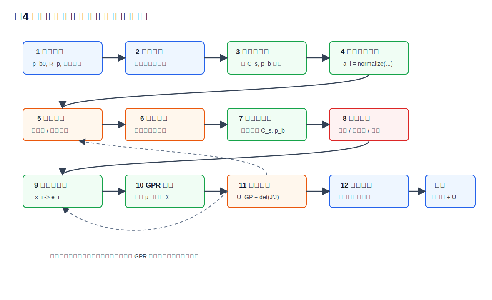
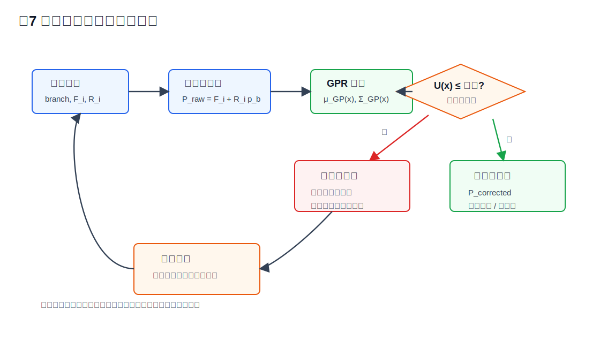

# 基于标准球约束与分支感知高斯过程的机器人五向测针标定误差补偿方法

版本：2026-06-15

英文题目：

Branch-Aware Calibration Error Compensation for a Robotic Five-Direction Touch-Trigger Probe Using Sphere Constraints and Gaussian Process Residual Modeling

## 摘要

工业机器人搭载五向触发式测针可用于复杂工件的在线检测，但机器人绝对定位误差、测针装配误差、触发预行程变化及横向分支非目标接触会降低测量精度。针对五向测针多分支误差不可共用补偿的问题，提出一种基于标准球约束与分支感知高斯过程的标定误差补偿方法。首先，建立五向测针各红宝石球相对于机器人法兰坐标系的分支独立几何模型；其次，基于标准球方向约束和距离约束构造两阶段标定方法，并通过鲁棒优化联合求解标准球球心和分支局部球心偏置；然后，依据球面残差、接近方向一致性、停止过行程和碰撞裕度识别异常触发样本；最后，采用分支感知高斯过程回归建立小样本残差补偿模型，并输出补偿不确定度以支持在线测量可信度判断。基于 CR5 工业机器人、RMP60 触发式测头和五向测针平台进行实验设计，预实验中 `y_neg` 分支 6 个有效标准球样本实现了约 `0.058 mm` 的拟合 RMS。后续五分支实验将比较名义几何、普通最小二乘、鲁棒最小二乘和所提残差补偿方法。该方法为机器人五向测针在机测量提供了可解释、可追溯且适合小样本场景的标定补偿方案。

关键词：机器人在机测量；五向测针；触发式测头；标准球标定；误差补偿；高斯过程回归；主动标定

## Abstract

Robotic on-machine measurement with a five-direction touch-trigger probe is promising for flexible inspection of complex workpieces. However, the measurement accuracy is affected by robot absolute positioning errors, probe assembly errors, touch-trigger pre-travel variation, stop overtravel, and unintended contacts of lateral probe branches. To address the problem that different ruby balls of a five-direction probe cannot share a single tool center point, this paper proposes a branch-aware calibration error compensation method based on sphere constraints and Gaussian process residual modeling. A branch-independent geometric model is first established for the ruby-ball center of each probe branch. Then, a two-stage calibration procedure is developed using distance-based coarse calibration and direction-constrained fine calibration with a reference sphere. Robust optimization is used to estimate the reference sphere center and branch-local ruby-ball offsets. Abnormal trigger samples are detected using sphere residuals, approach-direction consistency, stop overtravel, and collision clearance. Finally, a branch-aware Gaussian process regression model is trained to compensate the remaining small-sample residuals and provide prediction uncertainty for online confidence gating. The method is designed and preliminarily verified on a CR5 robot equipped with an RMP60 probe and a five-direction stylus. A preliminary `y_neg` branch experiment achieved a sphere-fitting RMS of approximately `0.058 mm` using six valid samples. The proposed framework provides an interpretable and traceable calibration compensation solution for robotic five-direction probe measurement.

Keywords: robotic on-machine measurement; five-direction probe; touch-trigger probe; reference sphere calibration; error compensation; Gaussian process regression; active calibration

## 1 引言

随着智能制造和柔性检测需求增长，工业机器人搭载测头进行在线测量逐渐应用于工件定位、加工后检测和生产线质量监控。相较于专用检测设备，机器人测量系统具有部署灵活、可达空间大、可与加工单元共享空间等优势。然而，工业机器人本体绝对定位精度通常低于其重复定位精度，测量结果会受到关节零偏、连杆参数偏差、末端工具装配误差、结构柔顺变形和控制器停止误差等因素影响。

触发式测头通过红宝石球与工件表面接触产生触发信号，具有结构简单和稳定性较高的特点。五向测针在轴向测针基础上增加四个横向分支，可测量侧壁、凹槽和多方向空间特征。五向测针的关键难点在于：五个红宝石球对应五个不同的局部球心，不能使用一个统一 TCP 代表整个测针。当不同分支采用同一工具补偿量时，分支间装配误差会直接转化为测量系统误差。

现有机器人标定方法主要包括参数化几何标定、非参数误差映射和数据驱动补偿。参数化方法通过修正 DH 参数、关节零偏或工具偏置提高绝对定位精度，但常难以表达触发方向相关误差。非参数方法如 RBF、Kriging、支持向量回归和高斯过程回归可对空间残差建模，但若缺乏测针结构约束，容易在小样本条件下泛化不足。深度学习补偿方法可表达复杂非线性误差，但通常需要较多样本，并且现场标定成本较高。

近年来，机器人标定研究出现了更适合高精度测量的方向。例如，无迹卡尔曼滤波结合可变步长 Levenberg-Marquardt 用于提高噪声环境下的参数辨识稳定性；粒子滤波结合启发式搜索用于处理非高斯噪声；高斯过程和 GP-UCB 主动学习用于小样本机器人运动学标定；物理约束注意力网络用于融合运动学方程和数据驱动残差补偿。这些方法说明，小样本概率建模、物理约束和主动补采是提升机器人测量精度的重要手段。

本文针对五向触发式测针的多分支结构，提出一种基于标准球约束和分支感知高斯过程的标定误差补偿方法。本文主要贡献如下：

1. 建立五向测针分支独立红宝石球心模型，避免多分支共用 TCP。
2. 提出标准球距离粗标定和方向精标定的两阶段标定流程。
3. 设计基于残差、过行程和碰撞裕度的异常触发识别方法。
4. 构建分支感知高斯过程残差补偿模型，实现小样本补偿和不确定度输出。
5. 设计基于不确定度和可观测性的主动补采策略，提高标定效率。

本文后续结构如下：第 2 节介绍测量系统与问题定义；第 3 节给出分支独立标定、异常识别和残差补偿方法；第 4 节设计实验方案和评价指标；第 5 节讨论已有预实验结果、五分支实验填充方式和工程适用性；第 6 节总结全文。

## 2 系统与问题定义

### 2.1 测量系统组成

本文研究对象为 CR5 工业机器人搭载 RMP60 触发式测头和五向测针的在线测量系统。五向测针包含五个分支：

```text
B = {z, x_pos, x_neg, y_pos, y_neg}
```

其中 `z` 为轴向分支，`x_pos`、`x_neg`、`y_pos` 和 `y_neg` 为四个横向分支。各分支末端均为红宝石球。本文实验中标准球直径为 20 mm，红宝石球半径为 1 mm，五向测针名义几何参数由系统配置文件给出。

测量系统与算法模块关系如图 1 所示。系统从机器人控制器读取触发瞬间法兰位姿与 DI 触发状态，从测针几何文件读取分支名义偏置，并通过标准球采集数据完成分支标定、异常剔除、残差补偿和在线门控。



表 1 给出本文实验平台和关键参数。

| 项目 | 参数 |
| --- | --- |
| 机器人 | CR5 六轴工业机器人 |
| 测头 | RMP60 触发式测头 |
| 测针 | 五向测针，分支为 `z`、`x_pos`、`x_neg`、`y_pos`、`y_neg` |
| 标准球 | 直径 20 mm，半径 `R_s = 10 mm` |
| 红宝石球 | 半径 `R_p = 1 mm` |
| 名义分支长度 | 75 mm |
| 主要数据 | 触发分支、法兰位置、法兰姿态、接近方向、过行程、碰撞裕度 |

### 2.2 数据采集

标准球触发数据包括：

```text
D = {branch_i, F_i, R_i, a_i, t_i, o_i, s_i}
```

其中 `branch_i` 为触发分支，`F_i` 为触发瞬间机器人法兰位置，`R_i` 为法兰姿态，`a_i` 为接近方向单位向量，`t_i` 为触发时间，`o_i` 为停止过行程，`s_i` 为路径安全状态。

### 2.3 问题定义

给定标准球触发数据和测针几何先验，目标是求解每个分支红宝石球心相对于法兰坐标系的局部偏置 `p_b`，并建立剩余误差补偿模型，使工件测量点：

```text
P_corrected = f(F_i, R_i, branch_i, a_i) - c(x_i)
```

尽可能接近真实接触点。其中 `c(x_i)` 为补偿模型输出的三维残差。

## 3 方法

### 3.1 分支独立几何模型

第 `b` 个分支红宝石球心在机器人法兰坐标系下的局部偏置定义为：

```text
p_b = p_b0 + delta_b
```

其中 `p_b0` 为名义偏置，`delta_b` 为装配误差。第 `i` 次触发时，红宝石球心在机器人基坐标系下为：

```text
P_i,b = F_i + R_i p_b
```

该模型显式区分不同分支，因此适用于五向测针跨分支测量。

五向测针分支独立几何模型如图 2 所示。本文不将五个红宝石球合并为一个 TCP，而是为每个分支保留独立局部偏置参数。



### 3.2 标准球距离粗标定

人工粗采阶段，接近方向可能存在误差。因此首先采用方向无关的距离约束：

```text
||F_i + R_i p_b - C_s|| = R_s + R_p
```

其中 `C_s` 为标准球球心，`R_s` 为标准球半径，`R_p` 为红宝石球半径。优化目标为：

```text
min sum rho_d((||F_i + R_i p_b - C_s|| - R_s - R_p)^2)
```

距离粗标定用于求得 `C_s` 和 `p_b` 初值，为后续自动法向触碰提供路径规划依据。

### 3.3 标准球方向精标定

当系统能根据两球心连线生成法向触碰路径时，采用方向约束：

```text
C_s = F_i + R_i p_b + a_i(R_s + R_p)
```

残差为：

```text
r_i,b = C_s - F_i - R_i p_b - a_i(R_s + R_p)
```

考虑名义几何先验和异常样本影响，建立鲁棒目标：

```text
min sum rho(||r_i,b||_2) + lambda sum ||p_b - p_b0||_W^2
```

其中 `rho(.)` 可选 Huber、Cauchy 或 Tukey 核。该目标函数既利用标准球几何约束，又限制小样本条件下的非物理偏移。

距离约束与方向约束的几何关系如图 3 所示。距离约束不依赖人工记录的接近方向，适合粗采初值；方向约束利用两球心连线或规划接近方向，适合精采后的高精度参数求解。



### 3.4 异常触发识别

五向测针横向分支触碰标准球时，可能发生测杆、中心结构、竖直分支或其他横向分支先接触。为减少异常样本对标定结果的影响，本文定义异常评分：

```text
S_i = w_r ||r_i,b|| + w_o |o_i| + w_theta theta_i + w_c C_i + w_q Q_i
```

其中：

1. `||r_i,b||` 表示球面残差。
2. `o_i` 表示停止过行程。
3. `theta_i` 表示接近方向与两球心连线方向夹角。
4. `C_i` 表示路径碰撞风险。
5. `Q_i` 表示同姿态重复性离散度。

当样本异常评分超过阈值，或任一关键安全指标超过阈值时，该样本被剔除。该策略适合识别横向分支纯竖直下压造成的非目标接触。

横向分支异常触发与路径安全筛查如图 4 所示。对于横向分支，若采用纯竖直下压，竖直分支、测杆或探头中心结构可能先于目标红宝石球接触标准球。因此，本文在路径规划阶段引入碰撞包络，在数据处理阶段引入异常评分。



### 3.5 分支感知高斯过程残差补偿

几何标定后仍存在剩余残差。本文采用高斯过程回归对残差进行小样本建模。输入特征为：

```text
x_i = [branch_i, F_i, R_i, a_i, o_i]
```

输出为三维残差：

```text
e_i = [e_x, e_y, e_z]
```

对每个坐标方向建立：

```text
e_k ~ GP(m_k(x), k_k(x, x')), k in {x, y, z}
```

核函数为：

```text
k_k(x, x') = k_p(F, F') + k_R(R, R') + k_a(a, a') + k_b(branch, branch')
```

其中位置核 `k_p` 描述空间相关性，姿态核 `k_R` 描述机器人姿态相关误差，方向核 `k_a` 描述触发方向相关误差，分支核 `k_b` 描述五个分支之间的相关性。

补偿后的点为：

```text
P_i^corr = P_i^raw - mu_GP(x_i)
```

预测不确定度为：

```text
U_i = trace(Sigma_GP(x_i))
```

当 `U_i` 超过阈值时，系统认为该测量点超出当前标定可信域。

分支感知 GPR 残差补偿结构如图 5 所示。与仅使用位置输入的残差映射不同，本文将分支、姿态、接近方向和过行程共同作为特征，以增强对五向测针触发误差来源的表达能力。



### 3.6 主动补采

为提高标定效率，本文根据 GPR 不确定度和参数可观测性选择补采姿态。候选点得分为：

```text
Score(x) = alpha U_GP(x) + beta log det(J_x^T J_x) - gamma Risk(x)
```

其中 `J_x` 为候选点对应的标定雅可比矩阵，`Risk(x)` 为路径碰撞风险和可达性代价。得分高的候选点能够补充当前误差模型薄弱区域，同时避免非目标接触。

完整方法流程如图 6 所示。流程中的异常剔除和主动补采均构成闭环，确保标定数据质量和补偿模型适用域逐步改善。



在线补偿门控如图 7 所示。当待测点不确定度超过阈值时，系统不直接输出高置信测量结果，而是提示补采、重新标定或降低结果置信等级。



### 3.7 算法流程

算法 1 总结了本文方法。

```text
算法 1：五向测针分支独立标定与 GPR 残差补偿
输入：名义几何 G，标准球半径 R_s，红宝石球半径 R_p，触发数据 D
输出：分支偏置 {p_b}，GPR 残差模型 M，在线补偿点 P_corr

1. 读取五向测针分支集合 B 和名义偏置 p_b0
2. for each branch b in B do
3.     采集人工粗采样本 D_b0
4.     用距离约束求解 C_s 与 p_b 初值
5.     根据两球心连线生成法向触碰候选路径
6.     进行可达性和碰撞包络筛查
7.     采集自动精采样本 D_b
8.     用方向约束和鲁棒核联合求解 C_s 与 p_b
9.     根据残差、过行程、方向夹角和碰撞裕度剔除异常样本
10. end for
11. 计算有效样本的几何标定残差 e_i
12. 若样本数量满足阈值，训练分支感知 GPR 模型 M
13. 在线测量时计算 P_raw = F_i + R_i p_b
14. 输出 P_corr = P_raw - μ_GP(x_i) 和 U_i = trace(Σ_GP(x_i))
15. 若 U_i 超过阈值，触发主动补采或低置信降级
```

## 4 实验设计

### 4.1 实验平台

实验平台包括：

1. CR5 六轴工业机器人。
2. RMP60 触发式测头。
3. 五向红宝石测针。
4. 20 mm 标准球。
5. 机器人控制与数据采集程序。

### 4.2 标定数据采集

每个分支采集不少于 6 个有效触发样本，优选 10 至 15 个样本。采样时应满足：

1. 姿态具有足够覆盖，尤其是 `RZ` 方向变化。
2. 横向分支避免纯竖直下压导致非目标结构接触。
3. 触发路径应具备足够碰撞裕度。
4. 每个分支至少包含若干重复样本用于估计重复性。

当前项目已有 `y_neg` 分支预实验数据。该数据包含 6 个有效样本，求解秩为 6，条件数约 12.90，标准球拟合 RMS 约 `0.058 mm`，最大残差约 `0.076 mm`。该结果表明，在接近方向和姿态覆盖合理时，单分支标准球方向约束标定具有较好稳定性。

表 2 给出当前可写入论文的预实验结果。五分支完整数据采集后，可在同一表格中补齐其余分支。

| 分支 | 有效样本数 | 秩 | 条件数 | RMS 残差/mm | 最大残差/mm | 备注 |
| --- | ---: | ---: | ---: | ---: | ---: | --- |
| `y_neg` | 6 | 6 | 12.90 | 0.058 | 0.076 | 已完成阶段性预实验 |
| `z` | 待填 | 待填 | 待填 | 待填 | 待填 | 五分支实验 |
| `x_pos` | 待填 | 待填 | 待填 | 待填 | 待填 | 五分支实验 |
| `x_neg` | 待填 | 待填 | 待填 | 待填 | 待填 | 五分支实验 |
| `y_pos` | 待填 | 待填 | 待填 | 待填 | 待填 | 五分支实验 |

### 4.3 对比方法

本文拟比较以下方法：

1. Nominal：使用名义五向测针几何参数。
2. LS：普通最小二乘分支偏置标定。
3. Robust-LS：加入鲁棒核和异常剔除的分支偏置标定。
4. Robust-LS + GPR：本文主方法。
5. Robust-LS + RBF：传统径向基函数残差补偿对照。
6. Physics-informed NN：样本量扩大后的物理约束神经网络对照。

表 3 为补偿方法对比的结果记录模板。

| 方法 | 标准球 RMS/mm | 标准球最大残差/mm | 平面 RMS/mm | 跨分支一致性/mm | P95/mm |
| --- | ---: | ---: | ---: | ---: | ---: |
| Nominal | 待填 | 待填 | 待填 | 待填 | 待填 |
| LS | 待填 | 待填 | 待填 | 待填 | 待填 |
| Robust-LS | 待填 | 待填 | 待填 | 待填 | 待填 |
| Robust-LS + GPR | 待填 | 待填 | 待填 | 待填 | 待填 |
| Robust-LS + RBF | 待填 | 待填 | 待填 | 待填 | 待填 |

### 4.4 评价指标

评价指标包括：

1. 标准球重构 RMS 残差。
2. 最大残差。
3. P95 残差。
4. 分支内重复性。
5. 分支间一致性。
6. 平面或立方体工件特征重构误差。
7. 异常样本识别率。
8. GPR 预测置信区间覆盖率。
9. 主动补采前后误差下降比例。

为验证各模块贡献，本文建议设置表 4 所示消融实验。

| 消融设置 | 分支独立建模 | 鲁棒核 | 碰撞筛查 | GPR 残差 | 主动补采 | 预期作用 |
| --- | --- | --- | --- | --- | --- | --- |
| A0 | 否 | 否 | 否 | 否 | 否 | 名义基线 |
| A1 | 是 | 否 | 否 | 否 | 否 | 验证分支偏置作用 |
| A2 | 是 | 是 | 否 | 否 | 否 | 验证抗异常能力 |
| A3 | 是 | 是 | 是 | 否 | 否 | 验证非目标接触筛查 |
| A4 | 是 | 是 | 是 | 是 | 否 | 验证残差补偿 |
| A5 | 是 | 是 | 是 | 是 | 是 | 验证主动补采闭环 |

## 5 结果与讨论

### 5.1 单分支预实验结果

`y_neg` 分支预实验显示，基于标准球方向约束的分支独立标定能够在 6 个样本下得到满秩解，RMS 残差约 `0.058 mm`。这说明五向测针分支局部偏置可通过标准球触碰数据有效辨识。

与早期人工粗采中出现的毫米级异常残差相比，采用法向触碰和异常筛查后，残差显著降低。这说明横向分支的触碰方向和非目标接触筛查是标定可靠性的关键。

### 5.2 五分支实验结果

本节待五分支完整数据采集后填入。建议表格如下：

```text
branch | samples | rank | condition | offset_x | offset_y | offset_z | RMS | max_error
```

分析重点包括：

1. 五个分支局部偏置与名义几何之间的差异。
2. 横向分支和轴向分支残差分布差异。
3. 姿态覆盖不足时条件数和残差的变化。
4. 异常剔除前后标定结果变化。

五分支实验完成后，建议重点报告三类现象：第一，五个分支 `p_b` 与名义偏置 `p_b0` 的差值，用以证明分支独立建模必要性；第二，剔除异常样本前后 RMS 与最大残差的变化，用以证明鲁棒异常识别有效性；第三，GPR 不确定度与留出误差的相关性，用以证明在线门控具有实际意义。

### 5.3 补偿方法对比

本节待补偿实验完成后填入。建议表格如下：

```text
method | sphere_RMS | sphere_max | plane_RMS | branch_consistency | P95
```

预期趋势为：名义几何误差最大，普通 LS 能降低固定偏置误差但易受异常点影响，Robust-LS 提高稳定性，Robust-LS + GPR 可进一步补偿空间和方向相关残差。

论文撰写时应避免只报告平均 RMS。建议同时报告最大残差和 P95 残差，因为五向测针横向分支的异常触发往往表现为少量大误差样本。若 GPR 的平均误差降低但最大误差不降，应检查补偿可信度门控是否正确拒绝了超出标定域的样本。

### 5.4 不确定度与主动补采

GPR 的优势在于能够输出预测不确定度。当待测姿态远离标定样本时，不确定度升高，系统可提示补采。主动补采应优先选择高不确定度、高可观测性且路径安全的姿态。该机制可避免在未覆盖姿态区域直接输出高置信测量结果。

### 5.5 工程讨论

本文方法适合当前现场标定小样本条件。深度神经网络或 Transformer 类误差补偿模型具有更强表达能力，但需要更多跨分支、跨姿态、跨空间位置样本。对于当前五向测针标准球标定流程，GPR 更适合作为主补偿算法，物理约束神经网络可作为后续数据积累后的扩展方案。

从工程实现角度看，本文方法需要重点控制三个环节。首先，触发瞬间法兰位姿必须与 DI 信号时间对齐，否则过行程将混入标定参数。其次，横向分支必须确保目标红宝石球先接触标准球，非目标接触样本即使能被优化算法拟合，也会破坏参数物理意义。最后，在线补偿必须保存模型版本和样本覆盖范围，避免模型更新后无法追溯历史测量结果。

## 6 结论

本文提出一种基于标准球约束与分支感知高斯过程的机器人五向测针标定误差补偿方法。该方法将五向测针各分支红宝石球心作为独立参数，通过标准球距离约束和方向约束实现两阶段标定，并结合鲁棒优化、异常触发识别和小样本 GPR 残差建模，提高了五向测针在机器人在线测量中的补偿可靠性。预实验表明，`y_neg` 分支在 6 个有效样本下可获得约 `0.058 mm` 的标准球拟合 RMS。后续工作将完成五分支完整实验、工件特征验证和物理约束神经网络对照实验。

## 参考文献初稿

[1] Z. Li, S. Li, and X. Luo, "A New Calibration Method for Industrial Robot Based on Step-Size Levenberg-Marquardt Algorithm," arXiv:2208.00702, 2022. https://arxiv.org/abs/2208.00702

[2] Z. Li, S. Li, and X. Luo, "A New Robot Arm Calibration Method Based on Cubic Interpolated Beetle Antennae Search Approach," arXiv:2204.06212, 2022. https://arxiv.org/abs/2204.06212

[3] E. Das and J. W. Burdick, "An Active Learning Based Robot Kinematic Calibration Framework Using Gaussian Processes," arXiv:2303.03658, 2023. https://arxiv.org/abs/2303.03658

[4] J. Yang, J. Rebello, and S. L. Waslander, "Next-Best-View Selection for Robot Eye-in-Hand Calibration," arXiv:2303.06766, 2023. https://arxiv.org/abs/2303.06766

[5] T. Chen and S. Li, "Highly Accurate Robot Calibration Using Adaptive and Momental Bound with Decoupled Weight Decay," arXiv:2408.12087, 2024. https://arxiv.org/abs/2408.12087

[6] X. Hou, Y. Jia, S. Zhang, and Y. Wu, "SPI-BoTER: Error Compensation for Industrial Robots via Sparse Attention Masking and Hybrid Loss with Spatial-Physical Information," arXiv:2506.22788, 2025. https://arxiv.org/abs/2506.22788

[7] P. Tobuschat, S. Duenser, M. Bambach, and I. Aschwanden, "A Unified Calibration Framework for High-Accuracy Articulated Robot Kinematics," arXiv:2601.16638, 2026. https://arxiv.org/abs/2601.16638

## 后续补齐清单

1. 完成五分支标准球数据采集。
2. 生成补偿前后对比表。
3. 增加工件平面、边线或孔位测量验证。
4. 绘制五向测针结构图、标准球约束图、算法流程图和残差分布图。
5. 将参考文献替换为目标 EI 期刊或会议要求格式，并优先补充已正式发表文献。
